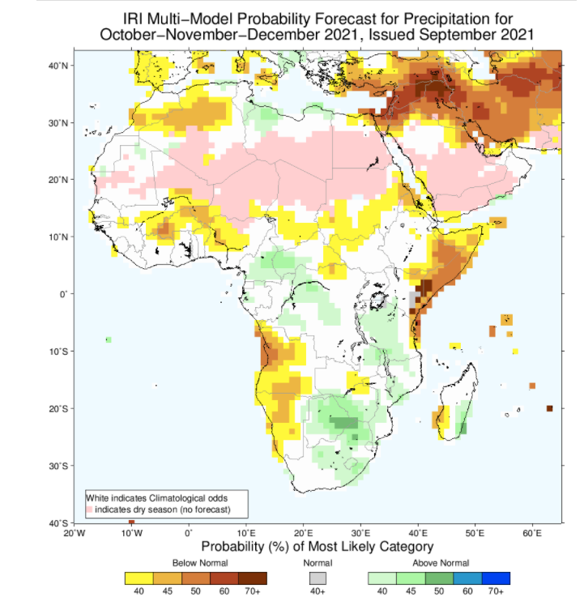
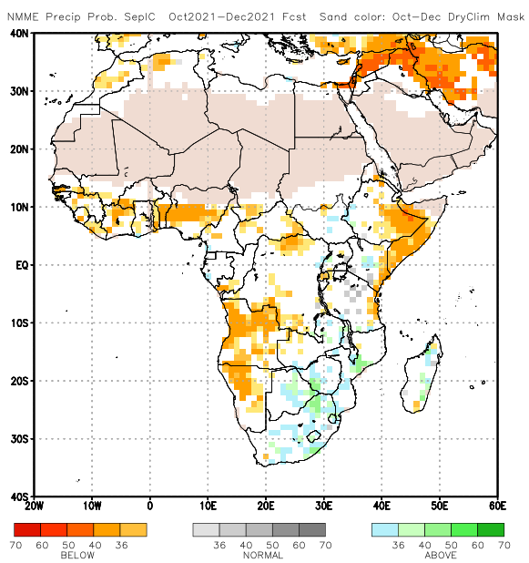
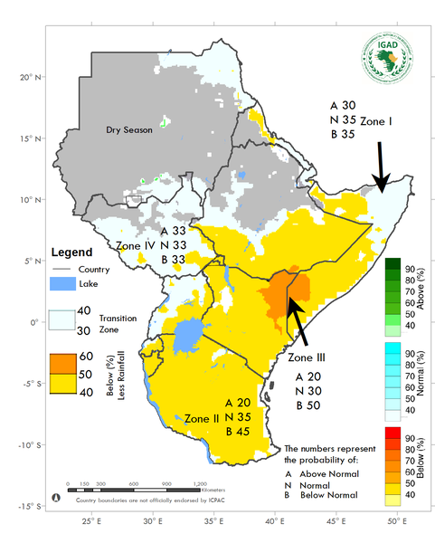
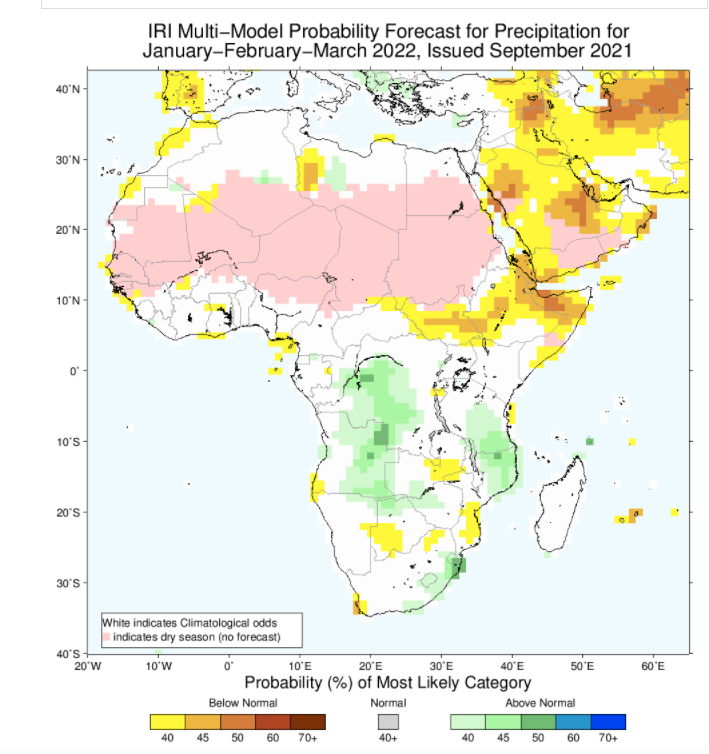
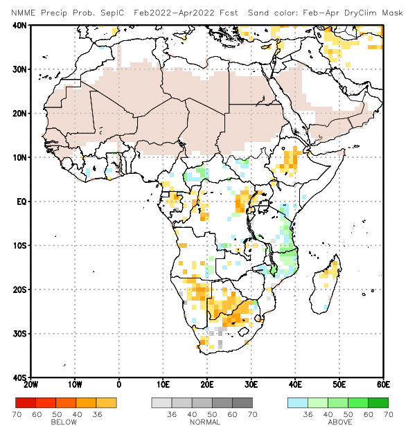

<br> 
<br>
<br>

# Ethiopia Baseline Risk Analysis
Analysis last updated 12-10-2021.

<br>

```{r setup, include = FALSE, message = FALSE, warning = FALSE}
# source("") # Link to external script
library(kableExtra)
library(knitr)
source('make_plots.R')
knitr::opts_chunk$set(echo = FALSE) # do not print code by default
knitr::opts_chunk$set(message = FALSE) 
knitr::opts_chunk$set(warning = FALSE)
```


This document is an initial exploration into risk of humanitarian need in Ethiopia. We're focusing most closely on climate-related risks, such as floods and drought. This document presents the outputs of basic data collection and analysis. It is intended to provide a starting point for a more in depth risk analysis for Ethiopia's upcoming Humanitarian Needs Overview. 

## Historical Analysis

### Frequency of past drought and flood events

The figure below shows the national count of shock events per year, as recorded in EM-DAT. 

```{r ts-basic, dpi=300, fig.height=2, fig.align="center", fig.cap='National count of shock events per year'}

# Put a figure in here, for example 

plot_disaster_annual

```

The figure below shows the frquency of floods (left) and drought (right) by region since 1965. 

```{r historical-freq, dpi=300, fig.height=5, fig.show="hold", fig.cap = 'Historical frequency of shock events by Region', out.width="50%"}

flood_map

drought_map

```

The tables below show the full lists of both the flood and drought events from EM-DAT. 

```{r event-table-flood, dpi=300}

emdat %>% 
  filter(`Disaster Type` == 'Flood') %>%
  select(c(Year, Location, Origin, `Total Affected`)) %>%
  knitr::kable(caption = "List of flood events",
               align = c('l')) %>%
        collapse_rows(columns = 1, valign = "top") %>%
        kable_styling(bootstrap_options = c("striped", "hover", "condensed", "responsive"),
                      fixed_thead = T) %>%
        scroll_box(width = "100%", height = "500px")

```

<br>
<br>

```{r event-table-drought, dpi=300}

emdat %>% 
  filter(`Disaster Type` == 'Drought') %>%
  select(c(Year, Location, Origin, `Total Affected`)) %>%
  knitr::kable(caption = "List of drought events",
               align = c('l')) %>%
        collapse_rows(columns = 1, valign = "top") %>%
        kable_styling(bootstrap_options = c("striped", "hover", "condensed", "responsive"),
                      fixed_thead = T) %>%
        scroll_box(width = "100%", height = "500px")

```

<br>
<br>

## Near-present situation

### IDP population

The figures below show the basic spatial distribution, volume, and demographics of Ethiopia's IDP population as identified by the [IOM DTM Site Assessment](https://data.humdata.org/dataset/ethiopia-baseline-assessment-data-iom-dtm) conducted in July 2021. 

```{r img1, fig.cap='IDP population breakdown by gender at Admin 2 level, symbols scaled by total IDP population', out.extra='style=padding:5px;"', fig.align='center'}
images1 <- c('img/gender-map-pop.png')
include_graphics(images1)
```

```{r img2, fig.cap='IDP population breakdown by age at Admin 2 level, symbols scaled by total IDP population', out.extra='style=padding:5px;"', fig.align='center'}
images2 <- c('img/age-map-pop.png')
include_graphics(images2)
```

```{r img3, fig.cap='Reason for displacement of IDPs at Admin 2 level', out.extra='style=padding:5px;"', fig.align='center'}
images3 <- c('img/reason-map-pop.png')
include_graphics(images3)
```

### Standardized Precipitation Index

As researched in past MapAction work in Ethiopia: 

> Standardized Precipitation Index (SPI) is the most commonly used indicator worldwide for detecting and characterizing meteorological droughts. It measures precipitation anomalies at a given location based on a comparison of observed total precipitation amounts for an accumulation period of interest (e.g. 3, 6, 9 months), with the long-term historic rainfall record for that period. Rainfall deficits (i.e. meteorological droughts) are indicated as SPI decreases below -1.0, while excess rainfall are indicated as SPI increases above 1.0. As SPI values are in units of standard deviation from the long-term mean, the indicator can be used to compare precipitation anomalies for any geographic location and for any number of time scales. The World Meteorological Organization has recommended that the SPI be used by all National Meteorological and Hydrological Services around the world to characterize meteorological droughts

The figure below shows the 3-month SPI for Ethiopia in September 2021, generated by IRI's [Global Drought Analysis Tool](https://iridl.ldeo.columbia.edu/maproom/Global/Drought/Global/CPC_GOB/Analysis.html).

```{r spi, out.extra='style=padding:5px;"', fig.align='center', out.width='75%'}

include_graphics('img/sept_spi.png')
```

## Forecasted situation

The OND season will most likely be poor. A first set of projections for MAM 2022 (by the Climate Hazard Center) are pessimistic. Note that forecasts for MAM are still early and particularly subject to change as the season draws nearer. Still, we have an early signal that we may be facing two more poor rainy seasons.

### October, November, December - 2021

```{r ond_iri, out.extra='style=padding:5px;"', fig.align='center', out.width='75%'}


```

```{r ond_nmme, out.extra='style=padding:5px;"', fig.align='center', out.width='75%'}


```

```{r icpac_ond, out.extra='style=padding:5px;"', fig.align='center', out.width='75%'}


```

### January, February, March - 2022

```{r jfm_iri, out.extra='style=padding:5px;"', fig.align='center', out.width='75%'}


```

### February, March, April - 2022

```{r fma_nmme, out.extra='style=padding:5px;"', fig.align='center', out.width='75%'}


```

### Other potentially relevant datasets 

1. [Global Flood Database](http://global-flood-database.cloudtostreet.info/#interactive-map)
- Gridded data of historical flood extents available via [Google Earth Engine](https://developers.google.com/earth-engine/datasets/catalog/GLOBAL_FLOOD_DB_MODIS_EVENTS_V1).
- Includes flood events from 2000-2018. Ethiopia has 28 events recorded.
- Events identified from the Dartmouth Flood Observatory, with flood extent mapped using MODIS satellite imagery.


2. [IDMC](https://data.humdata.org/dataset/idmc-idp-data-for-ethiopia)
- Number of IDPs, relating to conflict and disaster.
- Not subnational.
- Data available between 2008-2020.


3. [FAOSTAT Food Security Indicators](https://data.humdata.org/dataset/faostat-food-security-indicators-for-ethiopia)
- National level indicators from 2000-2020
- Such as: Prevalence of undernourishment (percent) (3-year average), Number of severely food insecure people (million) (3-year average), Percentage of population using safely managed sanitation services (Percent)
