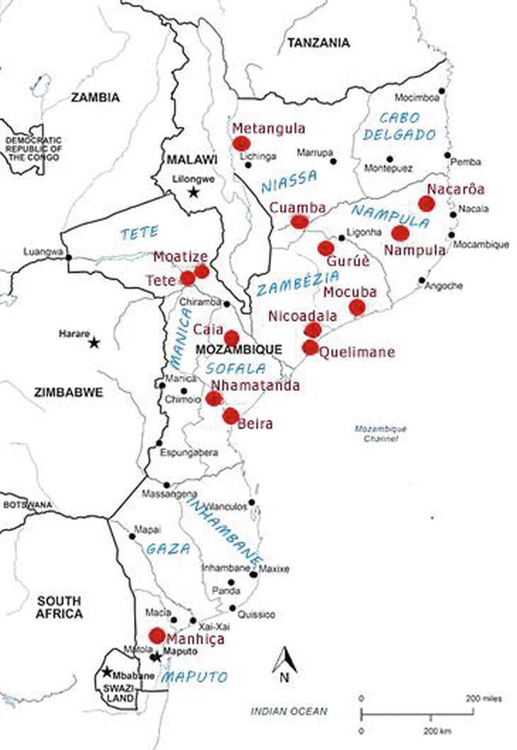

```{r setup, include=FALSE}
knitr::opts_chunk$set(echo = FALSE, warning = FALSE, message = FALSE)

library(tidyverse)
library(gt)
library(sf)
library(rmapshaper)

#################
#### LOADING ####
#################

cerf_df <- read_csv(
  file.path(
    Sys.getenv("AA_DATA_DIR"),
    "public",
    "raw",
    "glb",
    "cerf",
    "CERF Allocations.csv"
  )
)

cholera_df <- readxl::read_xls(
  file.path(
    Sys.getenv("AA_DATA_DIR"),
    "private",
    "raw",
    "moz",
    "moz_cholera_annual.xls"
  )
)

adm2_sf <- read_sf(
  file.path(
    Sys.getenv("AA_DATA_DIR"),
    "public",
    "raw",
    "moz",
    "cod_ab",
    "moz_admbnda_adm2_ine_20190607.shp"
  )
)

###################
#### WRANGLING ####
###################

# just keep Mozambique data and change year for joinability to cholera data
cerf_df <- filter(cerf_df, countryCode == "MOZ") %>%
  mutate(year = factor(year, levels = 2021:2000))

# long format and clean up a bit to match with spatial data
cholera_df <- pivot_longer(cholera_df,
                           `2015`:`2021`,
                           names_to = "year",
                           values_to = "cases") %>%
  mutate(year = factor(year, levels = 2021:2000),
         city = ifelse(str_detect(tolower(Distrito), "cidade"), "city", "not_city"),
         Distrito = case_when(
           Distrito %in% c("Nlhamankulu", "Kamaxakeni", "Kamavota", "Kamubukwana", "Matola") ~ "Cidade De Maputo",
           Distrito == "Nacala Velha" ~ "Nacala-A-Velha",
           TRUE ~ gsub("(?<=\\b)([a-z])", "\\U\\1", tolower(Distrito), perl=TRUE)
         ))

# simplify the adm2 polygon because plotting is taking up to 10 - 15 minutes
adm2_sf <- rmapshaper::ms_simplify(input = as(adm2_sf, 'Spatial')) %>%
  st_as_sf()

```

## General situation

It's difficult to distinguish the worst years at a country scale, although 2015, 2019, and 2020 have the most cases and correspond with the years that CERF allocated money specifically for a cholera rapid response in Mozambique.

```{r years, echo = F, fig.width=8, fig.height=4}
cerf_allocations <- cerf_df %>%
  filter(str_detect(tolower(projectTitle), "cholera"),
         windowFullName == "Rapid Response") %>%
  group_by(year) %>%
  summarize(projectTitle = paste(projectTitle, collapse = "; "))

cholera_df %>%
  group_by(year) %>%
  summarize(cases = sum(cases)) %>%
  left_join(cerf_allocations, by = "year") %>%
  ggplot(aes(y = year, x = cases, label = str_wrap(projectTitle, width = 100))) + 
  geom_bar(stat = "identity", fill = "#f28080") +
  geom_text(x = 50, hjust = 0, color = "white", size = 3.3) +
  theme_classic() +
  theme(axis.line = element_blank(),
        axis.ticks.y = element_blank(),
        axis.title = element_text(face = "bold"),
        axis.text.y = element_text(face = "bold")) +
  labs(y = "",
       x = "Cases")
```

## Urban cases

```{r urban_cases}
city_cases <- cholera_df %>%
  group_by(city) %>%
  summarize(count = length(unique(Distrito)), cases = sum(cases), .groups = "drop") %>%
  mutate(cases_percent = scales::percent(cases / sum(cases)))
```

Although cities only account for `r city_cases$count[1]` of `r sum(city_cases$count)` districts in Mozambique that have ever had cholera since 2015, they account for `r city_cases$cases_percent[1]` of all reported cases in the provided data. As well, they make up the 4 highest case totals at the district/year level seen in the data.

```{r highest_totals}
cholera_df %>%
  arrange(desc(cases)) %>%
  select(-city) %>%
  head() %>%
  gt() %>%
  tab_style(
    style = list(cell_text(weight = "bold")),
    locations = cells_column_labels()
  )
```


## Geographic distribution in worst years {#geomap}
<style> 
  #geomap > p { 
    margin-top: -50px; 
  } 
</style>

Outbreaks in the worst years have typically been quite localized.

- 2015, cases centred in Tete and the surrounding province. 
- 2019, mainly areas hit by Idai and Kenneth, primarily Beira.
- 2020 and 2021, spread around Cabo Delgado and the north.

```{r geodistro}
cholera_sf <- cholera_df %>%
  full_join(adm2_sf, by = c("Distrito" = "ADM2_PT")) %>%
  mutate(cases = replace_na(cases, 0.0000001)) %>%
  st_as_sf()

# data for labeling

labels_sf <- filter(cholera_sf,
                    (year == 2015 & Distrito == "Cidade De Tete") |
                    (year == 2019 & Distrito == "Cidade Da Beira") |
                    (year == 2020 & Distrito == "Cidade De Nampula")
) %>%
  st_as_sf()

beira <- filter(cholera_sf, year == 2015, Distrito == "Cidade Da Tete") %>%
  st_as_sf()

cholera_sf %>%
  filter(year %in% c(2015, 2019, 2020, 2021)) %>%
  ggplot() +
  geom_sf(aes(fill = cases), color = NA) +
  geom_sf(data = adm2_sf,
          fill = NA,
          color = "#888888",
          alpha = 0.2,
          lwd=0.1) +
  theme_void() +
  scale_fill_gradient(low = "white", high = "#e81919", trans = "log1p", breaks = c(0, 1000, 4000)) +
  facet_wrap(~factor(year, levels = 2000:2021), ncol = 4) +
  geom_sf_text(data = labels_sf, aes(label=str_wrap(Distrito, 9)), nudge_y = 1, nudge_x = -1, size = 3) +
  theme(strip.text = element_text(face = "bold", size = 12))
```

## Overall trend matches

<div style="float: left; width: 40%">
```{r hotspots_image}

```
</div>

<div style="float: right; width: 60%">
- In general, the map of the data matches the image of cholera interventions since 2013, sourced from this [survey study](https://www.intechopen.com/chapters/68460)
- However, noticed that some areas highlighted like Metangula in the NW are also mentioned in the [literature explicitly](https://www.intechopen.com/chapters/68460) but are not found at all in the data
- Turns out, we are missing a number of districts in the provided dataset
</div>

## Missing districts

```{r missing-districts-prep}
missing_sf <- adm2_sf %>%
  left_join(cholera_df, by = c("ADM2_PT" = "Distrito")) %>%
  filter(is.na(city)) %>%
  st_as_sf()
```

<div style="float: left; width: 40%">
And upon investigation, it looks like we are actually missing `r unique(missing_sf$ADM2_PT) %>% length` districts out of a total of `r unique(adm2_sf$ADM2_PT) %>% length`. We need to investigate whether this is because there were no recorded cases, maybe they were accidentally dropped, or the data is just generally unavailable?
</div>

<div style="float: right; width: 60%">
```{r missing-districts}
p_missing <- ggplot() +
  geom_sf(data = missing_sf,
          fill = "#f28080",
          color = NA) +
  geom_sf(data = adm2_sf,
          fill = NA,
          color = "lightgrey") +
  theme_void() +
  theme(axis.text = element_blank(),
        axis.ticks = element_blank(),
        plot.margin = unit(c(0, 0, 0, 0), "in")) +
  labs(x = NULL,
       y = NULL)

plot_ratio <- tmaptools::get_asp_ratio(adm2_sf)
```

```{r missing-districts-plots, out.width=750}
p_missing
```
</div>

## Data issues

While the data isn't suitable for trigger development, there are already other discrepancies in the data when compared to other sources. This is separate from the issue of missing districts.

- 2015 nationwide data: data has `r cholera_df %>% filter(year == 2015) %>% pull(cases) %>% sum` cases, but other reports have [7,073](https://www.intechopen.com/chapters/68460), [7,953](https://reliefweb.int/sites/reliefweb.int/files/resources/OCHA_ROSA_Cholera_Map_15April2015_.pdf) (by April alone)
- [6,739](https://reliefweb.int/sites/reliefweb.int/files/resources/OEW21-2026052019.pdf) cases by May 2019, but only `r cholera_df %>% filter(year == 2019) %>% pull(cases) %>% sum` in the data.
- District discrepancies in 2019: [149 cases in Metuge and 89 in Pemba initially recorded at start of outbreak](https://www.ncbi.nlm.nih.gov/pmc/articles/PMC6720437/), only `r cholera_df %>% filter(Distrito == "Metuge", year == 2019) %>% pull(cases)` and `r cholera_df %>% filter(Distrito == "Cidade De Pemba", year == 2019) %>% pull(cases)` respectively in data.
- Cidade De Nampula in 2016, only [171](https://scholar.google.com/scholar?hl=en&safe=off&as_q=Dengo-Baloi%20LL,%20Langa%20JP,%20Sem%C3%A1-Baltazar%20C,%20Chicumbe%20S.%20Avalia%C3%A7%C3%A3o%20dos%20eventos%20adversos%20p%C3%B3s%20campanha%20de%20vacina%C3%A7%C3%A3o%20oral%20contra%20c%C3%B3lera%20(EAAI-VOC)%20em%20cinco%20bairros%20da%20cidade%20de%20Nampula,%202016.%20Revista%20Mo%C3%A7ambicana%20de%20Sa%C3%BAde%20P%C3%BAblica.%202018;4:213) according to study, `r cholera_df %>% filter(Distrito == "Cidade De Nampula", year == 2016) %>% pull(cases)` in data
- [2,176](https://www.who.int/health-cluster/news-and-events/news/cholera-response-Mozambique/en/) cases in 2020 and [3,215](https://www.who.int/health-cluster/news-and-events/news/cholera-response-Mozambique/en/) by 21 March, 2021 alone, but `r cholera_df %>% filter(year == 2020) %>% pull(cases) %>% sum` in 2020 according to the data and `r cholera_df %>% filter(year == 2021) %>% pull(cases) %>% sum` in 2021, a complete change in narrative.

## Conclusion

As is, we have quite a few issues in the data as provided.

- Clearly, the main issue is that without weekly or daily data accessed directly, developing and implementing a trigger is not possible.
- However, other issues in the data also need resolution/clarity and question:
  - Why are certain districts missing?
  - Why is there such significant mismatch between data reported through academic/humanitarian sources?
- An academic researcher warned about the quality of cholera data being produced through the HIS in Mozambique. Based on these issues, do we want to expore alternative data options, such as sourcing data directly from health centres in key areas.